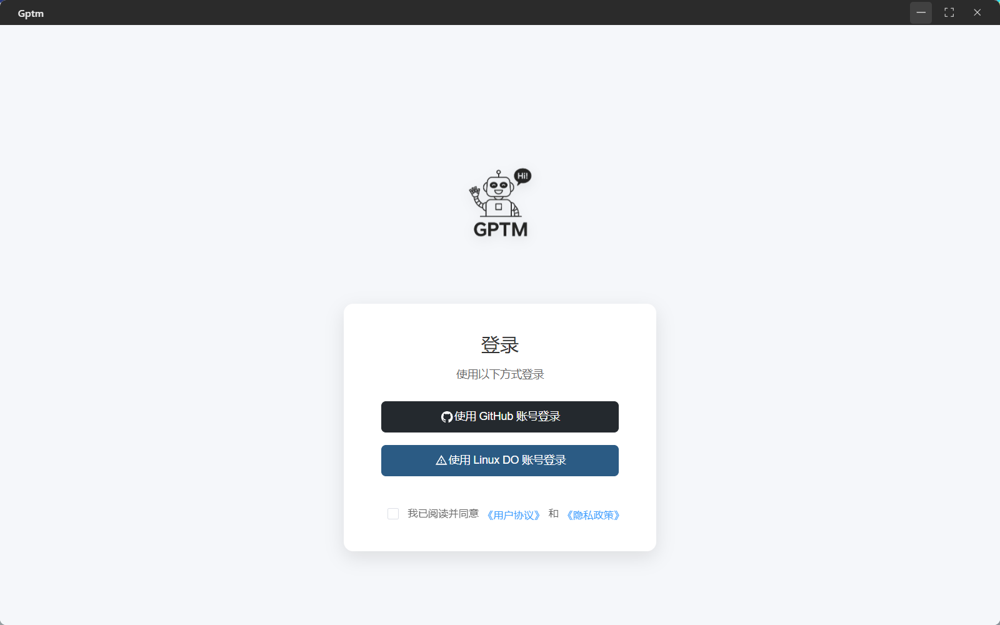
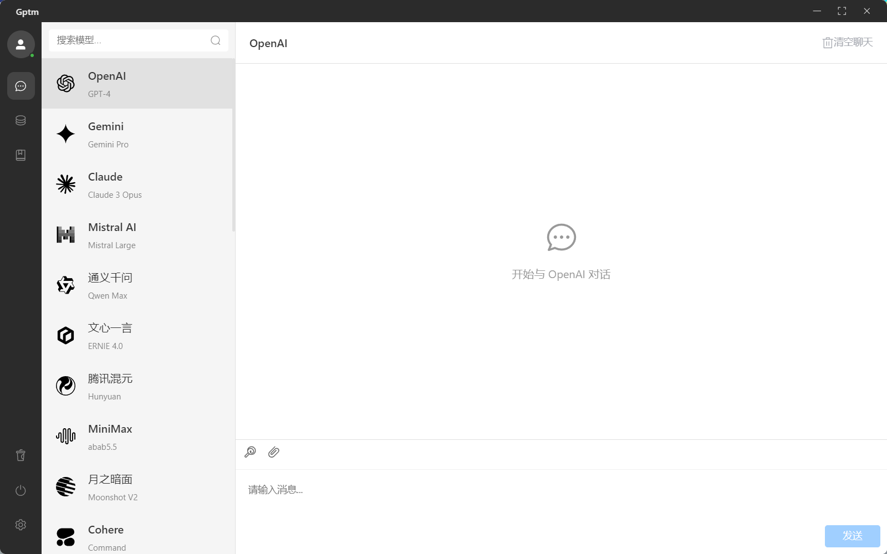
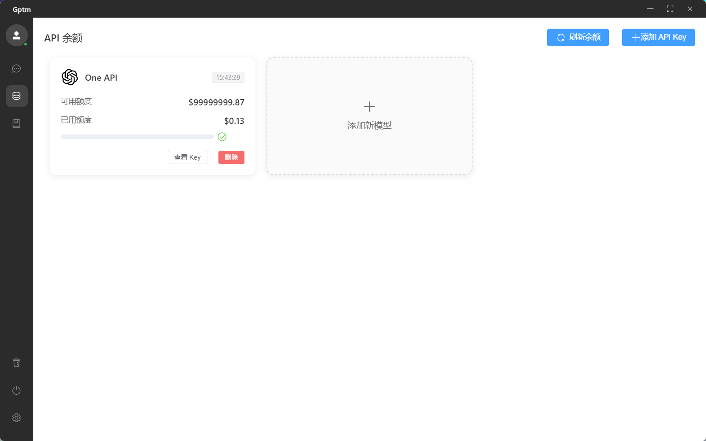
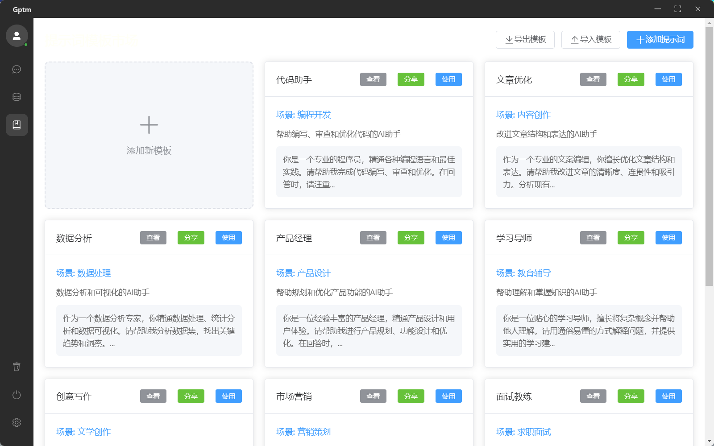
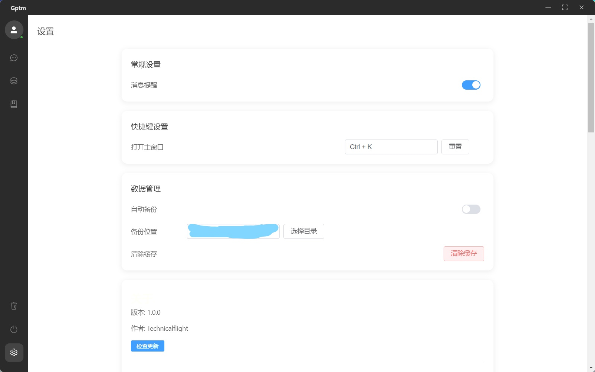

<div align="center">
  <a href="https://github.com/Technicalflight/Gptm/releases">
    
  </a>

[](https://github.com/Technicalflight/Gptm/network)  
[](https://github.com/Technicalflight/Gptm/stargazers)
[](https://github.com/Technicalflight/Gptm)


</div>


  <iframe height=498 width=510 src="https://cloud.wujiyan.cc/f/GP49h7/%E5%8A%9F%E8%83%BD%E4%BB%8B%E7%BB%8D.mp4">


# Gptm

一个基于 Electron + Vue3 + TypeScript 开发的现代化 AI 聊天客户端。

## ✨ 特性

### 🔑 多平台账号集成
- GitHub OAuth 登录支持
- Linux DO OAuth 登录支持
- 安全的授权流程和状态管理

### 💬 聊天功能
- 支持多个主流 AI 模型
- Markdown 语法渲染
- 代码高亮显示
- 文件上传和处理
- 聊天记录本地存储
- 表情符号支持

### ⚙️ 个性化设置
- 自定义快捷键
- 消息通知提醒
- 数据自动备份
- 主题设置(开发中)
- 多语言支持(开发中)

### 🛠️ 系统功能
- 自动更新
- 缓存管理
- 数据备份/恢复
- 系统托盘支持
- 全局快捷键

### 🔒 安全与隐私
- 用户协议与隐私政策
- 安全的 OAuth 授权
- 本地数据加密存储

## 🚀 开发计划

### 即将推出
- 🌍 多语言国际化支持
- 🎨 自定义主题
- 🔌 插件系统
- 📱 移动端适配
- 🎯 快捷回复功能
- 📊 数据统计分析
- 🔍 高级搜索功能
- 🔒 端到端加密

# 🎇 运行截图







## 🛠️ 技术栈

- 框架: Vue 3 + TypeScript
- 构建工具: Vite
- UI 组件: Element Plus
- 桌面端: Electron
- 路由: Vue Router
- 状态管理: Pinia
- 工具库: 
  - Axios (HTTP 客户端)
  - Day.js (日期处理)
  - Markdown-it (Markdown 渲染)
  - Highlight.js (代码高亮)

## 📦 安装

```bash
# 克隆项目
git clone https://github.com/yourusername/Gptm.git

# 安装依赖
npm install

# 开发模式运行
npm run dev

# 构建应用
npm run build
```

## 🤝 贡献

欢迎提交 Issue 或 Pull Request 来帮助改进这个项目。

## 🤗赞助

<div>
  <a href="https://afdian.com/a/aiGptm">
    
  </a>
    <a href="https://img.picui.cn/free/2024/10/26/671d0423b5462.jpg">
    
  </a>
      <a href="https://img.picui.cn/free/2024/12/30/67717aab2649a.png">
    
  </a>
</div>

## 🗣️联系我

[Email](mailto:gptm@wonai.top)

## 🙏 开源致谢

本项目对于使用到了的库或工具，在此特别感谢（排名不分先后，若有遗漏，欢迎反馈！）：

### 核心框架
- [Vue.js](https://github.com/vuejs/core) - 渐进式 JavaScript 框架
- [Electron](https://github.com/electron/electron) - 使用 JavaScript 构建跨平台桌面应用
- [TypeScript](https://github.com/microsoft/TypeScript) - JavaScript 的超集，添加静态类型
- [electron-vite](https://github.com/alex8088/electron-vite) - Electron + Vite 整合框架

### UI 组件
- [Element Plus](https://github.com/element-plus/element-plus) - 基于 Vue 3 的组件库
- [highlight.js](https://github.com/highlightjs/highlight.js) - 代码语法高亮库

### 路由和状态管理
- [Vue Router](https://github.com/vuejs/router) - Vue.js 官方路由
- [Pinia](https://github.com/vuejs/pinia) - Vue.js 状态管理库

### 开发工具
- [Vite](https://github.com/vitejs/vite) - 下一代前端构建工具
- [ESLint](https://github.com/eslint/eslint) - 可扩展的 JavaScript 代码检查工具

### 工具库
- [markdown-it](https://github.com/markdown-it/markdown-it) - Markdown 解析器

### Electron 相关
- [electron-builder](https://github.com/electron-userland/electron-builder) - Electron 应用打包工具
- [electron-updater](https://github.com/electron-userland/electron-updater) - Electron 自动更新模块
- [@electron/remote](https://github.com/electron/remote) - Electron 远程模块
- [@electron-toolkit/utils](https://github.com/alex8088/electron-toolkit) - Electron 工具集

## ⚠️ 免责声明

1. **软件性质**: 本项目提供的软件仅供学习和研究用途，是一个开源的聊天客户端工具。开发者不保证其适用于任何特定目的，也不对其功能的完整性和安全性做出任何承诺。

2. **用户责任**: 使用本软件所产生的任何内容、行为和后果，均由用户自行承担全部责任。开发者不对任何用户的行为或其产生的结果负责，包括但不限于言论、数据传输、文件分享等。

3. **第三方服务风险**:
   - 开发者不对任何第三方AI服务的可用性、准确性、安全性或可靠性负责。
   - 用户在使用本软件时，可能需要依赖第三方服务（如API、数据存储等），开发者不对这些服务的中断、故障、数据丢失或泄露负责。
   - 用户应自行评估并承担使用第三方服务的风险。

4. **无担保免责声明**: 本软件及其相关服务在“现状”基础上提供，不附带任何明示或暗示的担保，包括但不限于适销性、适合特定目的和不侵权的暗示担保。开发者不保证软件无错误、无病毒、无漏洞，也不保证其安全性或可靠性。

5. **责任限制**: 在任何情况下，开发者及其关联方均不对任何直接的、间接的、特殊的、偶然的、惩戒性的或后果性的损害负责，包括但不限于数据丢失、利润损失、业务中断或其他经济损失，无论是否已被告知此类损害的可能性。

6. **变更权利**: 开发者保留随时修改、更新或终止本软件及其相关服务的权利，且无需提前通知用户。开发者对任何此类变更不承担任何责任。

7. **最终用户责任**: 用户在使用本软件时，应遵守所有适用的法律法规，并对任何违反法律或本免责声明的行为承担全部责任。

通过使用本软件，您明确表示接受并同意以上所有条款。如果您不同意这些条款，请勿使用本软件。

## 📄 开源协议

[LICENSE](./LICENSE)


## Star History

<a href="https://star-history.com/#Technicalflight/Gptm&Timeline">
 <picture>
   <source media="(prefers-color-scheme: dark)" srcset="https://api.star-history.com/svg?repos=Technicalflight/Gptm&type=Timeline&theme=dark" />
   <source media="(prefers-color-scheme: light)" srcset="https://api.star-history.com/svg?repos=Technicalflight/Gptm&type=Timeline" />
   
 </picture>
</a>
